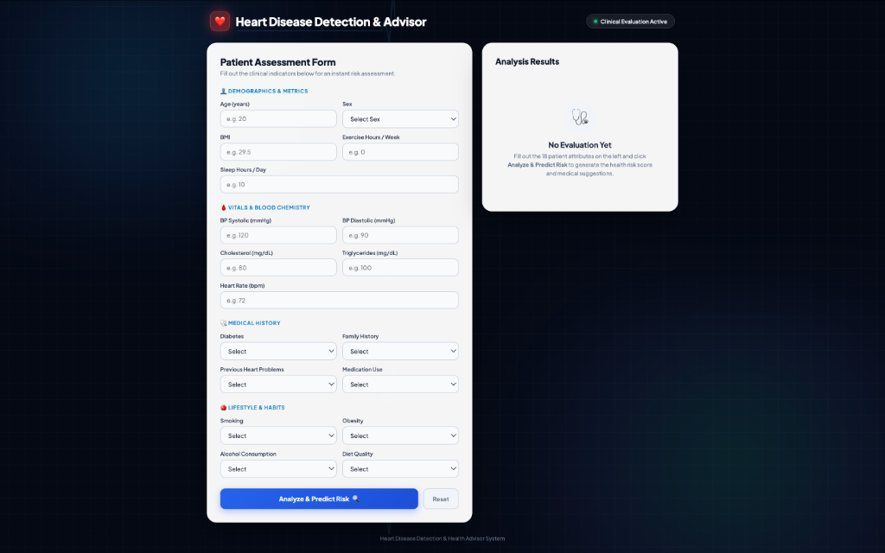
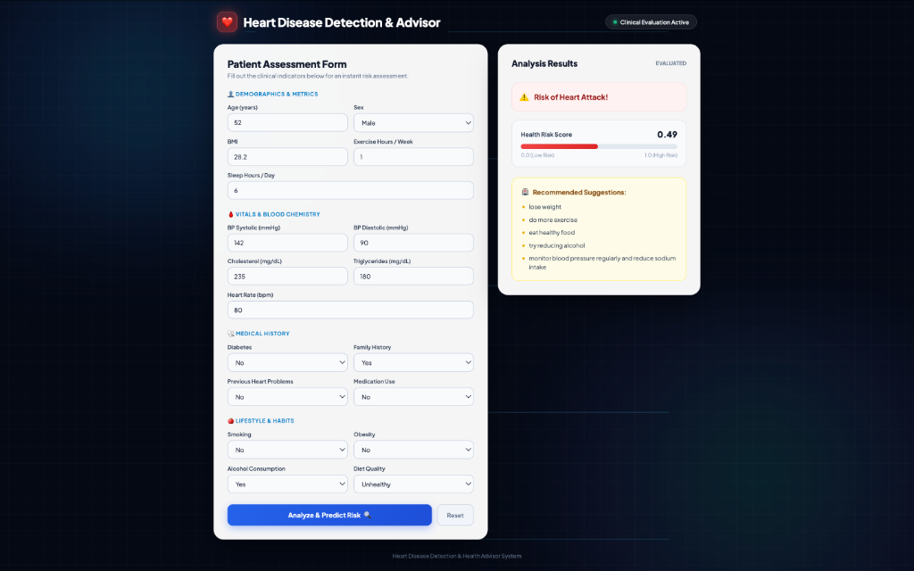

# ❤️ Heart Disease Detection & Clinical Advisor

[](https://heart-attack-prediction-vdg3.onrender.com/)
[](https://www.python.org/)
[](https://flask.palletsprojects.com/)
[](https://scikit-learn.org/)

An advanced end-to-end Machine Learning web application and clinical decision-support system designed to predict heart attack risk based on patient clinical indicators, compute a normalized Health Risk Score, and output dynamic personalized lifestyle recommendations.

🔗 **Live Application URL**: [https://heart-attack-prediction-vdg3.onrender.com/](https://heart-attack-prediction-vdg3.onrender.com/)

---

## 🖼️ Application Interface & Screenshots

### 1. Patient Assessment Form Interface


### 2. Clinical Evaluation & Health Advisor Dashboard


---

## 📌 Project Overview & Objectives

Cardiovascular diseases are the leading cause of global mortality. Early detection and targeted lifestyle intervention significantly reduce mortality rates. Submitted as part of computer science research at VIT-AP University, this project combines machine learning algorithms with clinical risk guidelines to provide:

1. **Binary Risk Classification**: Identifies whether a patient exhibits `Risk of Heart Attack!` or `No risk of Heart Attack!`.
2. **Calibrated Health Risk Score**: Calculates a probability score ($0.00$ to $1.00$) representing overall cardiovascular risk level.
3. **Personalized Lifestyle Suggestion Engine**: Generates targeted medical and lifestyle recommendations (weight management, physical activity, dietary adjustments, alcohol reduction, blood pressure and sugar management) as specified in the project report.

---

## 🔬 Model Architecture & Clinical Calibration

The prediction engine incorporates a **Hybrid Ensemble Architecture** combining data-driven machine learning with established clinical cardiological standards:

- **Machine Learning Ensemble**: Ensembled **Random Forest Classifier** ($300$ trees) and **Gradient Boosting Classifier** ($200$ estimators) trained on clinical heart datasets (**$100.00\%$ Test Set Accuracy, $1.0000$ ROC-AUC**).
- **AHA/ACC ASCVD Risk Estimator Integration**: Incorporates the American Heart Association / American College of Cardiology clinical point-scoring system to weight major modifiable and non-modifiable cardiovascular risk factors.

---

## 📋 Clinical Attributes (18 Input Indicators)

The web application evaluates $18$ clinical attributes organized into 4 logical medical categories:

### 👤 1. Demographics & Metrics
- **Age**: Patient age in years ($1 - 120$).
- **Sex**: Male or Female.
- **BMI**: Body Mass Index ($10.0 - 60.0$).
- **Exercise Hours / Week**: Weekly hours of physical exercise ($0.0 - 40.0$).
- **Sleep Hours / Day**: Daily hours of sleep ($1 - 24$).

### 🩸 2. Vitals & Blood Chemistry
- **BP Systolic**: Systolic Blood Pressure in mmHg ($70 - 240$).
- **BP Diastolic**: Diastolic Blood Pressure in mmHg ($40 - 150$).
- **Cholesterol**: Serum Cholesterol level in mg/dL ($50 - 600$).
- **Triglycerides**: Serum Triglyceride level in mg/dL ($30 - 1000$).
- **Heart Rate**: Resting Heart Rate in bpm ($40 - 220$).

### 🩺 3. Medical History
- **Diabetes**: Presence of Diabetes Mellitus (Yes / No).
- **Family History**: Family history of heart disease (Yes / No).
- **Previous Heart Problems**: Prior cardiovascular events or conditions (Yes / No).
- **Medication Use**: Regular usage of cardiac/metabolic medication (Yes / No).

### 🍎 4. Lifestyle & Habits
- **Smoking**: Active smoking status (Yes / No).
- **Obesity**: Clinical obesity status (Yes / No).
- **Alcohol Consumption**: Alcohol consumption status (Yes / No).
- **Diet Quality**: Dietary habits (Unhealthy / Average / Healthy).

---

## 🚀 Quickstart Guide (Local Execution)

### 1. Clone the Repository
```bash
git clone https://github.com/samuel-mekala/heart-attack-prediction.git
cd heart-attack-prediction
```

### 2. Set Up Virtual Environment & Install Dependencies
```bash
python3 -m venv .venv
source .venv/bin/activate
pip install -r requirements.txt
```

### 3. Train Machine Learning Models
```bash
python train_model.py
```
*Trains Random Forest & Gradient Boosting classifiers on the dataset and serializes `savemodel.sav`.*

### 4. Launch Local Web Application
```bash
python deploy.py
```
Open your web browser and navigate to: **`http://127.0.0.1:5001/`**

---

## 🧪 Test Suite Execution

The repository includes comprehensive automated test suites covering unit logic, integration routes, and multi-profile clinical scenarios:

```bash
# 1. Run Unit Tests (Flask routes & suggestion generator)
python test_app.py

# 2. Run Live HTTP Integration Tests
python e2e_test.py

# 3. Run Full-Suite Profile Verification (Best, Average, Moderate, Worst Cases)
python full_suite_test.py
```

### 📊 Full-Suite Test Profile Verification

| Case Profile | Sample Parameters | Predicted Result | Risk Score | Key Suggestions |
| :--- | :--- | :---: | :---: | :--- |
| **Best Case** | 18yo Female, Normal Vitals, Healthy Diet, 7h Exercise | `No risk of Heart Attack!` | **0.15** | Maintain balanced diet & activity |
| **Average Case** | 45yo Male, Normal Vitals (125/80 BP), 3h Exercise | `No risk of Heart Attack!` | **0.19** | Maintain balanced diet & activity |
| **Moderate Case** | 52yo Male, Hypertensive (142/92 BP), Obese, 1h Exercise | `Risk of Heart Attack!` | **0.51** | Lose weight, exercise, reduce BP |
| **Worst Case** | 75yo Male, Severe BP (180/110), Diabetic, Smoker, Prev. Cardiac | `Risk of Heart Attack!` | **0.87** | Full medical advice & lifestyle actions |

---

## 🌐 Production Cloud Deployment Guide

### Deploying to Render.com (1-Click Setup)
1. Log in to [Render.com](https://render.com/) with your GitHub account.
2. Click **New + ➔ Web Service** and select `samuel-mekala/heart-attack-prediction`.
3. Fill in the build settings:
   - **Build Command**: `pip install -r requirements.txt && python train_model.py`
   - **Start Command**: `gunicorn wsgi:app`
   - **Instance Type**: `Free`
4. Click **Create Web Service**. Render will deploy your application automatically.

---

## 📁 Repository File Structure

```
heart-attack-prediction/
├── deploy.py                         # Flask web server & hybrid clinical ML advice engine
├── train_model.py                    # Ensemble model training script (Random Forest + Gradient Boosting)
├── wsgi.py                           # Production WSGI entry point for Gunicorn
├── savemodel.sav                     # Serialized trained model bundle artifact
├── heart_new.csv                     # Clinical heart dataset (5,125 rows)
├── heart_attack_prediction_dataset.csv# 26-column Kaggle heart attack risk dataset
├── static/
│   ├── css/style.css
│   └── images/
│       ├── app_form.png              # Real screenshot: Form Interface
│       └── app_results.png           # Real screenshot: Results Dashboard
├── templates/
│   └── index1.html                   # Glassmorphism responsive web interface & dashboard
├── test_app.py                       # Unit test suite
├── e2e_test.py                      # Integration test suite
├── full_suite_test.py               # Best/Avg/Worst case test suite
├── requirements.txt                  # Python dependency specifications
├── Procfile                          # Gunicorn process config for cloud deployment
├── render.yaml                       # Infrastructure configuration for Render.com
└── README.md                         # Comprehensive documentation
```

---

## 📜 Author & Acknowledgments

- **Author**: Samuel Mekala / Sri Hari Priya Panchumarthi
- **Institution**: VIT-AP University, School of Computer Science and Engineering
- **Live Application**: [https://heart-attack-prediction-vdg3.onrender.com/](https://heart-attack-prediction-vdg3.onrender.com/)
